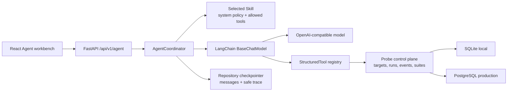

# ADR 007: LangChain Agent, Tool/Skill registry, and checkpointed conversations

Status: accepted, implemented in 0.7.0.

## Context

The 0.6 control plane put every Web-initiated probe through a LangChain Runnable,
but that boundary was not an intelligent Agent: it did not reason over messages,
select Tools, apply a Skill, or restore conversation memory. The reference design
separates a front-end entrance, an Agent, Tools, a checkpointer, and the large
model. The probe platform already owns reliable measurement and safe evidence,
so the Agent must reuse those capabilities rather than create another transport
or scoring implementation.

## Decision

- `OpenAICompatibleAgentModel` is a custom LangChain `BaseChatModel`. It supports
  OpenAI-compatible tool calls, makes one HTTP request per Agent iteration,
  follows no redirect, has no automatic retry, bounds response size, and never
  includes an upstream body in an exception. The API key is a Pydantic private
  attribute and is absent from model dumps, reprs, callbacks, and metadata.
  Provider content, tool names, IDs, arguments, and response metadata are
  redacted or replaced with locally generated values before the `AIMessage`
  crosses LangChain's process-global tracing boundary.
- `AgentCoordinator` owns the maximum four-iteration Tool loop. It loads the
  frozen target/model session snapshot and up to 30 checkpoint messages, binds
  only the selected Skill's Tools, appends LangChain `ToolMessage` results, and
  checkpoints the final sanitized answer.
- Skills are code-reviewed, immutable definitions containing a system policy,
  an allowlist of Tool IDs, descriptions, and starter prompts. They are not
  arbitrary uploaded prompts or executable Python.
- Tools are LangChain `StructuredTool` wrappers around existing repository reads
  and deterministic planning. They expose no credential argument, raw response,
  write mutation, or billable execution. `design_probe_plan` returns
  `requires_human_confirmation=true` and points to `/runs/new`.
  Tool arguments are filtered by the registered Pydantic schema and redacted
  before `StructuredTool.invoke`; outputs are redacted inside the Tool function
  before they can become trace outputs.
- SQLite and PostgreSQL implement the same Agent session, message, and event
  operations. A session freezes non-secret target connection metadata and model
  at creation. Messages and events are ordered per session; archive/restore and
  archive-before-purge follow the control-plane lifecycle. A bounded repository
  turn lease rejects concurrent turns for the same session, closing the gap
  between credential collision scanning and checkpoint reads across processes.
  A heartbeat renews long turns; every message, event, and quarantine write is
  fenced by the current token, so an expired older executor fails closed.
- The React workbench renders the call graph, conversation history, selected
  Skill, Tool registry, and live trace. A transient Key is held outside TanStack
  mutation variables and cleared in `onSettled`; prompt text uses the same
  one-shot ref boundary so pasted credentials cannot remain in MutationCache.

## Call sequence

1. React creates a session from an active target and Skill; FastAPI freezes a
   credential-free target/model snapshot.
2. React posts a message plus an optional transient Key. Pydantic validates the
   request and `AgentCoordinator` validates the target/key binding. If a newly
   designated key collides with an earlier session snapshot field, the session
   is scrubbed, archived as a security quarantine, and never sent to the model.
3. The exact key and recognizable credential shapes are redacted from the user
   text before either LangChain or the checkpointer sees it. Under the session
   turn lease, the repository atomically scans the complete snapshot, message
   history, and event history for a newly designated key.
4. The coordinator loads memory, adds the selected Skill system policy, and
   invokes the custom LangChain model once.
5. Tool calls are checked against the Skill allowlist and executed through
   `StructuredTool`. Only sanitized, bounded results become `ToolMessage` input.
6. Steps 4–5 repeat at most four times. The final answer and small execution
   events are redacted and persisted; the key is discarded.

## Consequences

The Agent can diagnose existing evidence and design a bounded next action while
keeping the billing decision with the operator. It cannot silently change a
target, launch a run, or persist a credential. Adding a future mutating Tool
requires a separate approval token, idempotency key, cost envelope, cancellation
contract, and independent billing/security review; read-only Tool registration
alone is insufficient.
