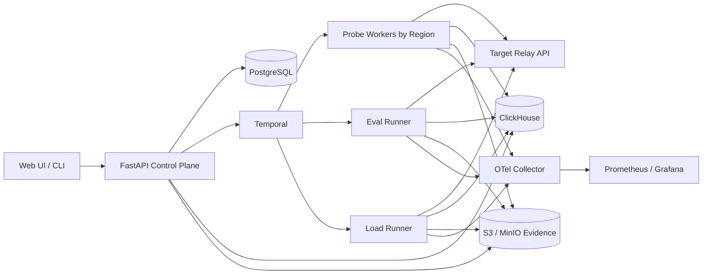
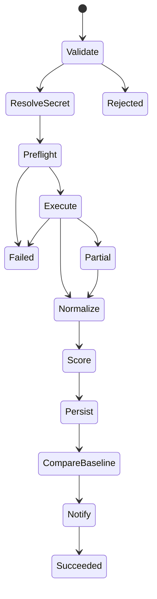

# AI API 中转站质量探针：技术与开发蓝图

状态：Draft v0.6（Phase 0.5 PostgreSQL 运行时适配已落地）
日期：2026-07-20
目标：为 OpenAI-compatible、Anthropic-compatible 及后续扩展的模型 API 中转站，提供可重复、可解释、可持续运行的质量检测。

## 1. 产品定义

这个工具不是简单的 `/health` 检测器，也不是单纯的模型排行榜。它需要同时回答五个问题：

1. 这个 API 现在能不能用？
2. 协议是否真的兼容，包括流式、工具调用、结构化输出和错误语义？
3. 延迟、吞吐、抖动和并发能力如何？
4. 输出能力是否符合标称模型，是否出现静默降级？
5. Token 统计、余额扣减和价格是否可信？

### 1.1 设计原则

- **分维度评分，不用一个总分掩盖问题**：总分只用于排序，必须同时展示各维度、样本量和置信度。
- **黑盒优先**：默认只依赖消费者真正能看到的 API 行为。
- **原始证据可追溯**：每个结论都能回到请求、响应块时间线、评分器版本和测试集版本。
- **确定性优先**：能用规则、Schema、标准答案评分时，不使用 LLM Judge。
- **基准可复现**：固定温度、输入、输出限制、并发模型、地域和时间窗口。
- **安全默认**：密钥只以 secret reference 保存；日志默认不保留密钥和完整敏感内容。
- **低干扰持续探测、显式授权压力测试**：常驻探针不自动升级为高并发压测。

### 1.2 非目标

- 不声称通过黑盒响应可以 100% 证明底层模型身份。
- 不把第三方返回的 `model`、`usage`、`system_fingerprint` 直接当作可信证据。
- 不在没有限额和授权的情况下寻找供应商最大承载能力。
- 第一阶段不自研通用大模型评测框架、可观测平台或压测引擎。

## 2. 质量模型与指标

### 2.1 六个一级维度

| 维度 | 建议权重 | 核心指标 | 硬门禁示例 |
|---|---:|---|---|
| 可用性 Availability | 25% | 成功率、超时率、连续故障、P95 恢复时间 | 24h 成功率低于 SLA |
| 协议兼容 Protocol | 15% | SSE、finish_reason、错误码、JSON、工具调用、模型列表 | 基础 Chat/SSE 不兼容 |
| 性能 Performance | 20% | TTFT、E2E、ITL、TPS、P50/P95/P99、抖动 | P95 TTFT 超阈值 |
| 输出质量 Quality | 20% | 正确率、指令遵循、结构化输出、长上下文、稳定性 | 核心用例明显退化 |
| 计费可信 Billing | 15% | usage 偏差、余额差分、价格偏差、异常扣费 | 重复或明显超额扣费 |
| 安全与透明 Security | 5% | TLS、密钥处理、数据保留声明、响应头信息 | 明文传输或密钥泄漏 |

总分建议使用加权几何平均，避免某个维度极差时被其他高分完全抵消：

```text
overall = 100 × Π((dimension_score / 100) ^ weight)
```

若触发硬门禁，则总体状态直接为 `FAIL`，总分仍保留用于诊断。

### 2.2 每个结果必须携带的可信度信息

```text
score
status: PASS | WARN | FAIL | UNKNOWN
sample_count
confidence_interval
measurement_window
probe_region
suite_version
adapter_version
```

样本不足或评分器失败时返回 `UNKNOWN`，不能当作失败，也不能用默认值补齐。

### 2.3 关键计算口径

```text
success_rate = successful_requests / attempted_requests
ttft = first_nonempty_content_chunk_at - request_sent_at
e2e = final_response_at - request_sent_at
itl = mean(delta_between_content_chunks)
output_tps = output_tokens / (final_response_at - first_content_chunk_at)
jitter = p95(metric) - p50(metric)
usage_deviation = abs(reported_tokens - locally_estimated_tokens) / max(locally_estimated_tokens, 1)
quality_regression = candidate_score - reference_baseline_score
```

必须同时保存两套 Token 值：`provider_reported_*` 与 `locally_estimated_*`。本地估算受 tokenizer、隐藏系统提示和推理 Token 影响，只作为异常信号，不应被描述为绝对真值。

## 3. 探针分层

| 层级 | 名称 | 频率 | 目的 |
|---|---|---|---|
| L0 | Reachability | 1–5 分钟 | DNS/TLS/连接、认证、`/models`、最小请求 |
| L1 | Protocol Conformance | 15–60 分钟 | 非流式、SSE、usage、JSON、工具调用、错误语义 |
| L2 | Performance Canary | 5–15 分钟 | 小样本 TTFT/E2E/TPS/抖动，不形成明显负载 |
| L3 | Capability & Quality | 每日/版本变化 | 固定题库、业务题库、长上下文、结构化能力 |
| L4 | Fidelity/Degradation | 每日/告警触发 | 与官方或可信基线做配对比较，识别能力漂移 |
| L5 | Billing Reconciliation | 每日/账单周期 | API usage、本地估算、余额前后差分、价目表核验 |
| L6 | Controlled Load Test | 手动/发布前 | 并发、请求率、goodput、限流和容量拐点 |

L0–L2 是在线轻量工作流；L3–L5 是批处理工作流；L6 必须带审批、预算和最大并发限制。

## 4. 开源项目吸收策略

### 4.1 选型结论

2026-07-19 重新核验：Promptfoo 为 MIT，EvalScope/AIPerf/GuideLLM 为
Apache-2.0，Llama Verifications 为 MIT；Langfuse 除 `ee` 目录外为 MIT。
具体 runner 隔离、版本锁定和升级门禁见
[`../lexsond/docs/open-source-integration.md`](../lexsond/docs/open-source-integration.md)。

| 项目 | 在本工具中的角色 | 集成方式 | 不直接承担的职责 |
|---|---|---|---|
| [Promptfoo](https://github.com/promptfoo/promptfoo) | 业务用例、声明式断言、回归评测、CI 报告 | 独立 runner/容器，读取 YAML，归一化结果 | 核心在线调度、原始 SSE 计时、账单核验 |
| [EvalScope](https://github.com/modelscope/evalscope) | 标准能力集、中文评测、Vendor Verifier、批量模型评测 | Python adapter 或隔离 runner；优先吸收其 2026 Vendor Verifier | 高频在线探测和统一存储模型 |
| [AIPerf](https://github.com/ai-dynamo/aiperf) | 受控性能与容量测试的首选引擎 | headless CLI/服务适配器，导入 JSON 结果 | 输出正确性和模型真实性判断 |
| [GuideLLM](https://github.com/vllm-project/guidellm) | 数据集驱动的性能测试、AIPerf 交叉验证/备选 | CLI/API adapter | 日常健康探测和计费核验 |
| [Llama Verifications](https://github.com/meta-llama/llama-stack-evals) | Llama 供应商协议与能力 fixture 参考 | 复用测试思想和允许复用的 fixture；隔离执行 | 非 Llama 模型的身份结论 |
| [Langfuse](https://github.com/langfuse/langfuse) | 可选的评测追踪与人工分析界面 | 通过 OTLP/API 导出，不作为主数据库 | 核心控制面和 SLO 判定 |
| [OpenTelemetry GenAI conventions](https://github.com/open-telemetry/semantic-conventions/blob/main/docs/gen-ai/gen-ai-metrics.md) | 指标与 Trace 命名基线 | 原生埋点并固定 semconv 版本 | 产品专属质量、账单和身份字段 |

### 4.2 明确不选

- **GenAI-Perf 不作为新项目基础**：其 README 已说明逐步淘汰，并推荐 AIPerf。
- **简单 Key Checker 不作为探针核心**：只能证明一次认证或模型列表调用成功，不能证明服务稳定、模型真实或计费准确。
- **不 fork Promptfoo/EvalScope 形成长期私有分支**：优先使用版本锁定的 runner adapter，减少上游升级成本。

### 4.3 开源吸收门禁

每个依赖在进入主分支前必须完成：

1. LICENSE 与传递依赖核验。
2. 固定版本或镜像 digest，禁止直接跟随 `latest`。
3. 记录输入/输出契约和失败语义。
4. 用 3 个 fixture 验证：成功、上游超时、畸形输出。
5. 禁止把外部 runner 的私有内部对象直接写入核心表；先转换为统一结果模型。
6. runner 无法使用时，核心 L0–L2 探针仍能独立工作。

### 4.4 已冻结的开源结果边界

- Promptfoo：JSON output v3，仅导入断言状态、分数、延迟和 Token 汇总，不导入原始输出。
- AIPerf：`profile_export_aiperf.json` schema 1.x，严格按报告中的单位解释指标。
- EvalScope：仅接受生产者版本 `1.9.0` 的 `reports/*.json`；报告本身不带版本，因此版本必须来自受信任 runner 快照。`reviews/*.jsonl` 只作为受限原始证据保存。
- EvalScope Vendor Verifier 首批覆盖 Kimi、K2、MiniMax；Kimi 的传输/推理错误率单独设为零容忍，不能被算成“正确拒绝参数”。

## 5. 推荐技术栈

### 5.1 第一阶段生产栈

| 层 | 选型 | 理由 |
|---|---|---|
| 核心语言 | Python 3.12+ | EvalScope、AIPerf、GuideLLM 与模型生态集成成本最低 |
| API 控制面 | FastAPI + Pydantic v2 | 类型契约清楚、异步友好、自动 OpenAPI |
| 原生探针客户端 | `httpx` + 自研 SSE parser | 精确记录连接、首字节、首内容块、每个 chunk 时间；避免 SDK 隐藏细节 |
| 持久工作流 | Temporal Python SDK | 定时、重试、超时、取消、补偿和长任务恢复语义明确 |
| 元数据与配置 | PostgreSQL 16+ + SQLAlchemy 2 + Alembic | 事务、版本化配置、关系查询 |
| 高频测量数据 | ClickHouse | 高基数时序与分位数聚合；MVP 可先落 PostgreSQL 分区表 |
| 原始证据/报告 | S3/MinIO | 保存脱敏后的 response timeline、runner 报告和测试集快照 |
| 缓存/限流 | Redis | 分布式 rate limit、短期状态和幂等锁；不作为事实来源 |
| 可观测性 | OpenTelemetry Collector + Prometheus + Grafana | 统一 Trace/Metrics；采用固定版本 GenAI semconv |
| Secret | Vault 或云 KMS/Secret Manager | 数据库只保存 `secret_ref`，不保存明文 Key |
| 前端 | Next.js + TypeScript | 质量矩阵、时间序列、单次证据回放 |
| 本地运行 | Docker Compose | 一条命令启动 API、worker、Postgres、MinIO、Temporal |
| 生产运行 | Kubernetes + Helm | 探针地域化、worker 隔离、水平扩展和配额控制 |

### 5.2 为什么不一开始拆很多微服务

第一阶段使用“模块化单体控制面 + 独立 worker/runner”：

- `control-api`：配置、查询、鉴权、触发工作流。
- `probe-worker`：原生协议、性能 canary、计费采集。
- `eval-runner`：Promptfoo/EvalScope 隔离进程或容器。
- `load-runner`：AIPerf/GuideLLM，只有显式任务才启动。

它保留运行隔离和横向扩展能力，同时避免过早引入服务间契约爆炸。

## 6. 系统架构



### 6.1 区域探针

每个 probe worker 必须标记：

```text
region
cloud_or_isp
egress_ip_hash
runtime_version
clock_offset
network_baseline
```

网络基线用于区分“中转站慢”和“探针所在网络慢”。至少设置一个不经过中转站的稳定 HTTP 目标作为对照，但不能把对照目标的故障算入供应商评分。

## 7. 核心领域模型

### 7.1 主要实体

```text
Provider
  id, name, provider_type, status

Endpoint
  id, provider_id, base_url, protocol, region_hint, secret_ref

ModelRoute
  id, endpoint_id, advertised_model, expected_family, price_plan_id

ProbeSuite
  id, name, version, layer, config_json, content_hash

ProbeSchedule
  id, endpoint_id, suite_id, cron, region_selector, enabled

ProbeRun
  id, workflow_id, endpoint_id, suite_version, state, started_at, finished_at

ProbeCaseResult
  id, run_id, case_id, status, score, reason_code, evidence_uri

RequestMeasurement
  run_id, request_id, region, status_code, error_class,
  dns_ms, connect_ms, tls_ms, ttfb_ms, ttft_ms, e2e_ms,
  chunk_count, itl_ms, output_tps,
  reported_input_tokens, reported_output_tokens,
  estimated_input_tokens, estimated_output_tokens

DimensionScore
  run_id, dimension, score, status, sample_count, confidence_json

Baseline
  model_family, suite_version, reference_type, distribution_json, valid_from

PricePlan
  currency, input_unit_price, output_unit_price, cache_price, reasoning_policy

AlertEvent
  endpoint_id, rule_id, state, fingerprint, opened_at, resolved_at
```

### 7.2 不可变性

- `ProbeSuite.version + content_hash` 一经执行不可修改。
- ProbeRun 只能引用执行时的 Endpoint 配置快照，不读取后来被修改的配置。
- 原始响应正文默认脱敏并按短周期保留；指标与 hash 可长期保留。
- Secret 永远不进入 Workflow 参数、日志、Trace attribute 或结果 JSON。
- 重跑产生新的 run，不覆盖旧结果。

## 8. 探针 DSL

用 YAML 描述探针意图，执行时编译成不可变的 suite snapshot：

```yaml
apiVersion: probe.ai/v1alpha1
kind: ProbeSuite
metadata:
  name: openai-compatible-canary
spec:
  layer: L2
  protocol: openai-chat
  request:
    model: "{{ advertised_model }}"
    stream: true
    temperature: 0
    max_output_tokens: 64
    messages:
      - role: user
        content: "Reply with exactly: PROBE_OK"
  sampling:
    warmup: 1
    requests: 10
    concurrency: 1
    timeout: 30s
    max_cost_usd: 0.10
  assertions:
    - type: http_status
      equals: 200
    - type: exact_text
      equals: PROBE_OK
    - type: sse_sequence_valid
    - type: finish_reason_present
    - type: ttft_ms
      p95_lte: 3000
    - type: success_rate
      gte: 0.99
  retention:
    response_body: 24h
    measurements: 180d
```

DSL 编译器必须拒绝：无上限输出、无超时、L6 无预算、明文 Key、未知 assertion、与 endpoint capability 不兼容的组合。

## 9. 运行时工作流编排

### 9.1 通用状态机



### 9.2 Temporal Workflow 划分

已实现 SDK 无关、可事件重放的 `CanaryWorkflow` 领域核心，以及固定
`temporalio==1.30.0` 的 Temporal 适配层。Temporal 提供持久计时器、Activity
执行、查询与取消；产品 Journal 保持为独立审计契约。探针步骤关闭 SDK 自动重试，
由领域工作流记录失败并执行冻结的重试策略；Journal Activity 则保留有限幂等重试。
设计决策见
[`../lexsond/docs/adr/002-replayable-canary-workflow.md`](../lexsond/docs/adr/002-replayable-canary-workflow.md)
和
[`../lexsond/docs/adr/004-temporal-canary-adapter.md`](../lexsond/docs/adr/004-temporal-canary-adapter.md)。

```text
CanaryWorkflow
  validate_config
  preflight_endpoint
  execute_native_probe
  normalize_measurements
  compute_dimension_scores
  compare_slo
  persist_and_notify

QualityEvaluationWorkflow
  freeze_suite_and_dataset
  budget_check
  run_promptfoo_or_evalscope
  import_normalized_results
  compare_baseline_distribution
  persist_and_notify

BillingReconciliationWorkflow
  capture_balance_before (if supported)
  execute_fixed_token_cases
  capture_balance_after
  estimate_local_tokens
  reconcile_usage_price_balance
  persist_and_notify

ControlledLoadWorkflow
  require_approval_and_budget
  acquire_endpoint_exclusive_lease
  preflight_canary
  run_aiperf_profile
  enforce_kill_switch
  import_results
  release_lease
```

### 9.3 重试语义

- DNS 临时失败、连接重置、HTTP 502/503：指数退避并限制总尝试次数。
- 401/403、Schema 不兼容、预算超限：不重试。
- 429：尊重 `Retry-After`，记录为容量/限流证据，不无限重试掩盖问题。
- runner 崩溃与目标 API 失败分别归类。
- 所有 Activity 使用 idempotency key：`run_id + case_id + attempt_class`。

### 9.4 告警防抖

```text
open: 3 个连续窗口失败，或单次触发硬门禁
update: 状态仍异常但指标显著变化
resolve: 3 个连续窗口恢复
fingerprint: endpoint + model_route + rule + region_scope
```

## 10. 协议测试重点

OpenAI-compatible 第一版至少覆盖：

- `/v1/models`
- `/v1/chat/completions` 非流式和 SSE 流式
- `[DONE]`、空 delta、role chunk、usage chunk、finish reason 顺序
- Unicode、多字节字符跨 chunk、畸形 JSON chunk
- `response_format` / JSON Schema
- 单/多工具调用，参数 JSON 完整性和 tool_call id
- 认证失败、模型不存在、限流、请求过大、超时的状态码和错误 body
- 客户端取消后连接是否及时释放
- 长上下文边界与静默截断

Anthropic-compatible 在第二阶段加入 `/v1/messages`、event type 顺序、thinking block、tool use 和 usage 语义。

## 11. 模型质量与真实性检测

### 11.1 质量评分顺序

1. 精确匹配、数值容差、JSON Schema、可执行代码测试。
2. 标准 benchmark 自带 scorer。
3. 参考答案的语义/事实评分。
4. LLM-as-a-Judge，仅作为补充并记录 judge 模型、prompt 和版本。

### 11.2 Fidelity 不能只做“猜模型”

更可靠的输出是“与声明的基线是否一致”：

```text
CONSISTENT
SUSPECTED_DEGRADATION
INSUFFICIENT_EVIDENCE
```

比较至少包含：

- 同一套题的配对正确率差异及置信区间。
- JSON/tool/vision/long-context 等能力指纹。
- 多次采样的拒答率、格式遵循率、长度和稳定性分布。
- 与可信官方 API 同期运行的参考样本，避免旧基线误报。
- 价格和速度异常只能作为辅助信号，不能单独证明换模。

## 12. 计费核验设计

计费检测分三层证据：

1. 响应 `usage`：供应商自报。
2. 本地 tokenizer 估算：独立但存在模型与隐藏提示误差。
3. 余额/账单差分：若供应商提供余额或账单接口，这是最接近消费者实际支出的证据。

输出示例：

```json
{
  "reported_cost": 0.0124,
  "calculated_from_reported_usage": 0.0120,
  "observed_balance_delta": 0.0125,
  "local_token_estimate_cost": 0.0118,
  "deviation": {
    "price_vs_reported": 0.0333,
    "balance_vs_calculated": 0.0417
  },
  "confidence": "MEDIUM",
  "notes": ["reasoning token policy not exposed"]
}
```

严禁为了追求固定输出长度而让模型无限生成。使用可校验短输出，并为测试任务设定金额预算和日预算。

## 13. 控制面 API 草案

```text
POST   /v1/providers
GET    /v1/providers
POST   /v1/endpoints
GET    /v1/endpoints/{id}
POST   /v1/endpoints/{id}/verify

POST   /v1/probe-suites
GET    /v1/probe-suites/{id}/versions
POST   /v1/schedules

POST   /v1/runs
GET    /v1/runs/{id}
POST   /v1/runs/{id}/cancel
GET    /v1/runs/{id}/measurements
GET    /v1/runs/{id}/evidence

GET    /v1/scorecards?endpoint_id=&window=
GET    /v1/alerts
POST   /v1/load-tests/{id}/approve
```

统一错误格式：

```json
{
  "error": {
    "code": "PROBE_BUDGET_EXCEEDED",
    "message": "The configured run cost budget was exceeded",
    "details": [{"limit_usd": 1.0, "estimated_usd": 1.4}],
    "request_id": "..."
  }
}
```

## 14. 代码仓库结构

```text
lexsond/
  apps/
    control_api/
    web/
  packages/
    domain/                 # 纯领域模型与评分规则
    probe_protocols/        # OpenAI/Anthropic adapters + SSE parser
    probe_dsl/              # YAML schema、编译和静态校验
    workflows/              # Temporal workflows/activities
    storage/                # PostgreSQL/ClickHouse/S3 adapters
    observability/          # OTel conventions and exporters
    runner_contracts/       # 外部 runner 的稳定输入输出契约
  runners/
    promptfoo/
    evalscope/
    aiperf/
    guidellm/
  suites/
    protocol/
    canary/
    quality/
    billing/
  tests/
    unit/
    contract/
    integration/
    replay/
    e2e/
  deploy/
    compose/
    helm/
  docs/
    adr/
    runbooks/
```

## 15. Agent 开发流程

这里的 Agent 指参与代码开发的智能体；与运行时探针 Workflow 分开管理。

### 15.1 单个变更的标准闭环


每个 Issue 必须提供：

- 问题与非目标。
- 输入/输出契约。
- 可执行验收标准。
- 涉及的模块和禁止修改的边界。
- 测试命令。
- 安全、成本和兼容性风险。

### 15.2 Agent 角色

| 角色 | 输出 | 限制 |
|---|---|---|
| Research Agent | 上游版本、接口、许可证、可复用点证据 | 不改生产代码 |
| Spec Agent | ADR、API/事件 Schema、验收标准 | 不用实现细节偷换需求 |
| Implementation Agent | 小范围代码和测试 | 不修改未声明模块 |
| Test Agent | 黑盒、回放、故障注入和差分测试 | 不根据实现降低预期 |
| Review Agent | 正确性、安全、可运维性审查 | 不与实现 Agent 共享“默认正确”假设 |
| Integration Agent | 合并、迁移、端到端验证 | 只接受通过门禁的工件 |

小变更不必启用所有角色；高风险项（Secret、计费、评分、并发压测、数据库迁移）必须有独立 Review/Test。

### 15.3 并行开发规则

- 按包或 adapter 分配文件所有权，避免多个 Agent 同时编辑同一文件。
- 先冻结 `runner_contracts` 和领域事件，再并行开发各 runner。
- Agent 之间通过 PR、测试 fixture、Schema 和 ADR 交接，不通过口头假设交接。
- 外部框架适配器一个 Agent 一个目录；核心领域模型由单一 owner 集成。
- 并行分支合并前先运行 contract tests，再运行全量 integration tests。

### 15.4 Definition of Done

任何功能只有同时满足以下条件才算完成：

1. 验收标准逐条有测试证据。
2. 正常、超时、取消、畸形响应至少各有覆盖。
3. 日志和 Trace 中没有 Secret 或完整认证头。
4. 指标名字、单位、维度基数经过检查。
5. 数据迁移可向前执行，并有回滚/兼容说明。
6. 新外部依赖已固定版本并记录许可证。
7. 有用户文档和故障处理说明。
8. 真实 OpenAI-compatible mock server 端到端测试通过。

## 16. 测试策略与门禁

### 16.1 测试金字塔

- Unit：计时计算、Token 偏差、评分、DSL 校验、脱敏。
- Contract：OpenAI/Anthropic fixture、runner 输入输出、数据库 repository。
- Replay：保存合法与畸形 SSE transcript，使用虚拟时钟重放。
- Integration：Temporal + Postgres + MinIO + mock relay。
- Differential：同一请求经官方 SDK 与原生客户端执行，比较语义而非内部对象。
- E2E：创建 endpoint → 执行 suite → 评分 → 告警 → 恢复。
- Soak：24 小时轻量运行，检查内存、连接泄漏、重复调度和指标基数。

### 16.2 CI 门禁

```text
format/lint
type-check
unit tests
secret scanning
dependency/license scan
contract tests
integration tests
schema migration check
container vulnerability scan
reproducible build
```

外部真实 API 测试放在受控 nightly 环境，使用低权限测试 Key、金额预算和脱敏日志，不在普通 PR 中暴露 Secret。

## 17. 分阶段实施

### Phase 0：两周技术验证

交付：

- 原生 OpenAI Chat/SSE parser 与时间线。
- 一个可配置 endpoint、一个 L0/L1/L2 suite。
- Promptfoo、EvalScope、AIPerf 三个 runner spike。
- 统一 `NormalizedRunResult` JSON Schema。
- mock relay：正常、慢首 Token、断流、错误 usage、429、伪流式。

退出条件：同一批 fixture 可重复得到一致结果；Secret 不进入日志；能区分目标错误与 runner 错误。

### Phase 1：四至六周 MVP

交付：

- FastAPI 控制面、PostgreSQL、Temporal、MinIO。
- 调度、取消、预算、幂等、区域标签。
- 六维 scorecard，但 L4 仅提供“疑似退化/证据不足”。
- Promptfoo 业务题库与 EvalScope 标准题库适配。
- AIPerf 手动压测任务。
- Prometheus/Grafana 和基础 Web 报告。

退出条件：至少两个真实 OpenAI-compatible 中转端点连续运行 7 天，告警无重复风暴，所有测量可回溯。

### Phase 2：生产增强

- ClickHouse 与多地域 worker。
- Anthropic Messages、Embedding、Vision、Rerank。
- 账单/余额 connector 与价目表版本化。
- 官方参考 API 配对基线与统计置信度。
- RBAC、审计日志、组织隔离、Webhook/IM 告警。
- Kubernetes/Helm、SLO 和容量规划。

### Phase 3：生态化

- 插件 SDK、公开 suite registry、签名测试集。
- 社区 provider adapters。
- 可验证的匿名榜单数据导出。
- 对供应商开放自测但不允许覆盖第三方测量结果。

## 18. 第一批开发 Backlog

按依赖顺序实施：

1. ADR-001：统一结果模型与时间语义。
2. `mock-relay`：SSE/错误/计费故障模拟器。
3. 原生 OpenAI client：连接与 chunk timeline。
4. DSL v1alpha1 + JSON Schema。
5. 评分引擎：Availability/Protocol/Performance。
6. PostgreSQL schema 与 evidence object contract。
7. Temporal `CanaryWorkflow`。
8. Promptfoo runner adapter。
9. EvalScope runner adapter。
10. AIPerf runner adapter + L6 审批/kill switch。
11. Billing reconciliation v0。
12. Scorecard API 和最小 Web UI。

前三个 Issue 完成前不要开发漂亮仪表盘；没有可信时间线和故障 fixture，图表只会放大错误数据。

## 19. 需要通过 Spike 验证的风险

| 风险 | 验证方式 | 决策点 |
|---|---|---|
| SDK 隐藏首内容块与网络阶段 | `httpx` 原生时间线与官方 SDK 差分 | 原生 client 是否覆盖所有协议 |
| 不同 tokenizer 导致误判 | 3 家模型、短/长/中文/工具调用样本比较 | 偏差阈值按模型族配置 |
| LLM Judge 漂移 | 固定 100 条人工标注集，跨版本一致性 | Judge 只作辅助或纳入生产 |
| Temporal 运维成本 | Compose/K8s 恢复、取消、重试演练 | MVP 保留 Temporal 或退回轻队列 |
| 外部 runner 输出不稳定 | 版本锁定 + golden JSON contract | adapter 维护成本是否可接受 |
| 中转站隐藏系统提示 | 官方端点配对 + usage 差分 | 只能标注置信度，不做绝对指控 |

## 20. 架构决策摘要

第一版应当自行掌握三项核心资产：**原始协议时间线、统一结果模型、评分与证据链**。质量题库和压测引擎尽量吸收成熟开源项目，通过隔离 adapter 集成。这样既能快速获得 Promptfoo/EvalScope/AIPerf 的能力，又不会让产品的数据与工作流被任何一个项目绑定。

Phase 0 的测量口径、runner 归一化、故障分类、可重放编排和 PostgreSQL
持久化边界已经得到可执行验证。下一步进入 Phase 1 的控制面、云对象存储与真实端点
连续运行，而不是继续扩张本地验证范围。

## 21. 当前落地状态（2026-07-20）

已完成并有自动化测试证据：

- 增量 UTF-8 SSE parser、`[DONE]`/断流/畸形 JSON 检测；
- OpenAI-compatible 流式与非流式原生探针；
- TTFT、TTFB、E2E、ITL、output TPS 和 chunk timeline；
- 正常、慢 TTFT、错误 usage、429、断流、伪流式、错误输出 mock；
- `NormalizedRunResult` v1alpha1 和 JSON Schema；
- 有界 ProbeSuite 编译器，拒绝明文密钥、未知字段、无超时、无输出上限、
  不兼容断言和无预算 L6；
- 多请求聚合执行，以及 Availability/Protocol/Performance/Quality 四维评分；
- 成功率 Wilson 95% 区间、P95 延迟、exact text、finish reason、SSE 完整性
  和伪流式断言。
- 外部 runner job/outcome Schema，区分 `TARGET_FAILED` 与 `RUNNER_FAILED`；
- Promptfoo JSON v3、AIPerf summary schema 1.x、EvalScope 1.9.0 报告适配器；
- EvalScope Kimi/K2/MiniMax Vendor Verifier 策略和脱敏 review 契约；
- Promptfoo 原始回答不进入核心结果；AIPerf 单位和 schema major 严格校验；
- 外部 runner 无 shell 启动器：版本白名单、suite digest、最小环境变量、超时/取消、
  进程组终止、有界日志、Secret 脱敏和产物 hash。
- 可重放 `CanaryWorkflow` 领域核心：不可变输入 hash、乐观并发事件日志、稳定幂等键、
  有界重试、取消、崩溃恢复，以及目标故障与工作流故障分离。
- PostgreSQL workflow/result/evidence/activity 初始迁移和原子 compare-and-append 函数；
- PostgreSQL Journal 适配器，用于崩溃恢复、并发冲突和损坏历史验证；
- EvidenceManifest、本地内容寻址不可覆盖存储、保留期/脱敏策略，以及持久化前移除
  原始输出和错误正文的 redaction 边界。
- Temporal Python SDK 1.30.0 适配：Journal/Step Activities、确定性事件 ID、持久
  retry timer、Heartbeat 取消、运行中 Query、目标失败继续处理和官方 Replayer 历史回放；
  官方本地 Temporal Server 端到端覆盖成功、重试、查询与取消审计。
- PostgreSQL Temporal worker 组合根与原生 Activity delegate：endpoint/suite 不可变快照、
  Activity 内凭据引用解析、preflight/完整 suite、异步心跳监督、
  批次取消、结果脱敏、内容寻址证据、Activity 完成结果幂等和最终结果不可变；启动命令
  只接收无密钥参数。真实 Temporal + mock relay 已跑通完整链路。
- psycopg 3.3.4/PostgreSQL 16 运行时适配：显式连接池、Workflow run 幂等初始化、
  endpoint/suite digest 绑定解析、纯状态机投影后的事务 CAS 追加、Activity 有界租约、
  失败原样重放、最终结果/证据元数据不可变，以及 NOLOGIN control/worker/reader
  最小权限角色。
- opt-in 真实 PostgreSQL 集成门禁：临时实例 migration up/down、同槽位精确重放与
  冲突并发、完整 Workflow 运行/回放、租约接管、结果/快照不可变和角色权限均通过。
- Temporal worker PostgreSQL 组合模式与远程不可变 suite 启动参数；DSN 和密钥值只从
  `LEXSOND_*` 环境变量进入进程，credential binding 文件只保存引用和变量名。

尚未完成：生产级容器网络/文件系统隔离、多地域 Temporal worker 部署与外部 runner
Activity delegate、云对象存储/原生 Secret Manager 客户端、
Billing/Security 两个维度、
工具调用/JSON Schema/长上下文、真实中转站 7 天连续验证。Phase 0 的外部 runner
结果边界、进程启动边界、Canary 编排语义、Temporal 适配和 PostgreSQL 持久化实现
已经打通；下一阶段接入 S3/MinIO 与控制面，再对真实端点做受预算约束的连续验证。
